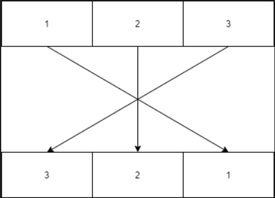
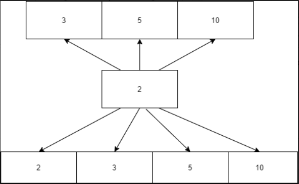
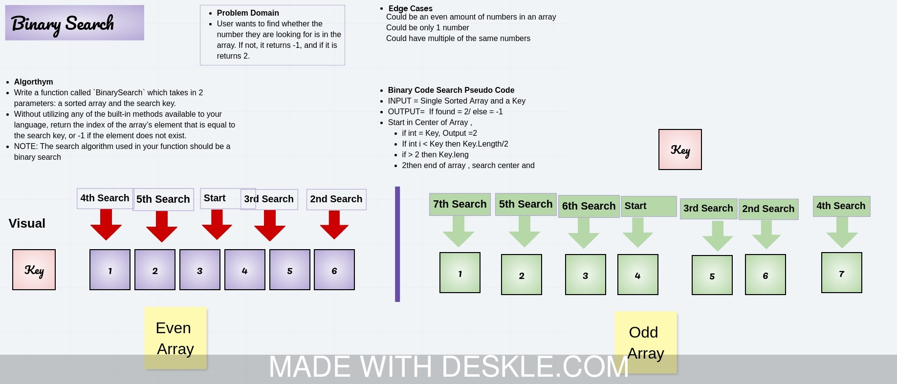
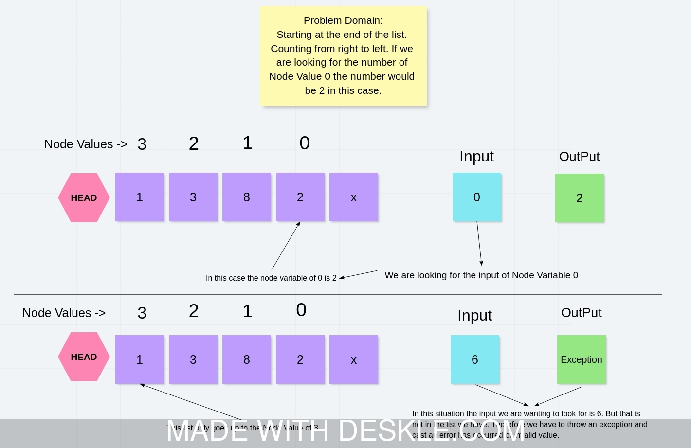

# 401-data-structures-and-algorithms

# Reverse an Array
<!-- Short summary or background information -->
Use a ArrayReverse() to reverse an array

## Challenge
<!-- Description of the challenge -->
Take an array of ints and reverse it

## Approach & Efficiency
<!-- What approach did you take? Why? What is the Big O space/time for this approach? -->

## Solution
<!-- Embedded whiteboard image -->

# Unit Tests & Documentation
Write a function called insertShiftArray which takes in an array and the value to be added. Without utilizing any of the built-in methods available to your language, return an array with the new value added at the middle index.

## Challenge
Insert a number in the center of an array of numbers

## Approach & Efficiency

## Solution

# Binary search
<!-- Short summary or background information -->
Taking an array and splitting it into 2 sections over and over.

## Challenge
<!-- Description of the challenge -->
Write a function called BinarySearch which takes in 2 parameters: a sorted array and the search key. Without utilizing any of the built-in methods available to your language, return the index of the array’s element that is equal to the search key, or -1 if the element does not exist.

## Approach & Efficiency
<!-- What approach did you take? Why? What is the Big O space/time for this approach? -->
Binary Code Search Pseudo Code 
INPUT = Single Sorted Array and a Key
OUTPUT=  If found = 2/ else = -1
Start in Center of Array , 
if int = Key, Output =2
If int i < Key then Key.Length/2
if > 2 then Key.leng
2then end of array , search center

## Solution
<!-- Embedded whiteboard image -->

# Class 05: Linked List Implementation

# Linked List Implementation
<!-- Short summary or background information -->
Create a loop for a node and be able to go to the next node.

## Challenge
<!-- Description of the challenge -->
Create a Node class that has properties for the value stored in the Node, and a pointer to the next Node.

## Approach & Efficiency
<!-- What approach did you take? Why? What is the Big O space/time for this approach? -->

# Class 06: Linked list insertions

# Linked List Implementation
<!-- Short summary or background information -->

## Challenge
<!-- Description of the challenge -->

Utilize the Single-responsibility principle: any methods you write should be clean, reusable, abstract component parts to the whole challenge. You will be given feedback and marked down if you attempt to define a large, complex algorithm in one function definition.

You have access to the Node class and all the properties on the Linked List class.

Write tests to prove the following functionality:

Can successfully add a node to the end of the linked list
Can successfully add multiple nodes to the end of a linked list
Can successfully insert a node before a node located i the middle of a linked list
Can successfully insert a node before the first node of a linked list
Can successfully insert after a node in the middle of the linked list
Can successfully insert a node after the last node of the linked list
Unit tests must be passing before you submit your final solution code.

## Approach & Efficiency

# Class 05: Linked List Implementation

## Challenge
<!-- Description of the challenge -->
Write a method for the Linked List class which takes a number, k, as a parameter. Return the node’s value that is k from the end of the linked list. You have access to the Node class and all the properties on the Linked List class as well as the methods created in previous challenges.

## Approach & Efficiency
<!-- What approach did you take? Why? What is the Big O space/time for this approach? -->
